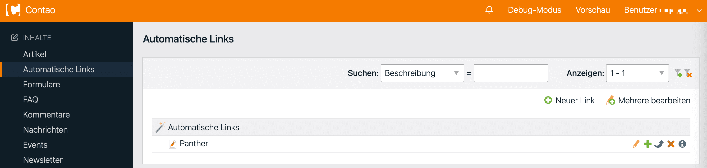
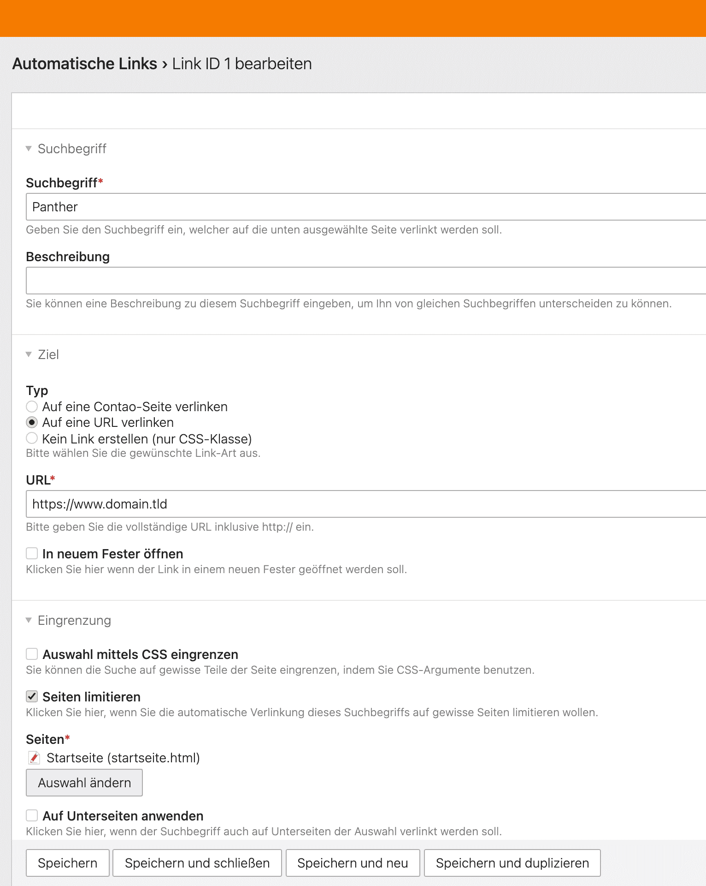
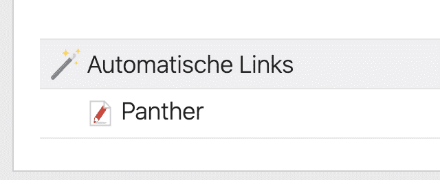

<p align="center"></p>

**Deutsch** | [English](README.en.md)

# Autolink – Automatische Verlinkung für Contao

Autolink bietet eine Backend-Oberfläche, um Suchbegriffe zu definieren, die im
Frontend automatisch verlinkt werden. Die Erweiterung durchsucht die gerenderte
Seitenausgabe nach den konfigurierten Begriffen und erzeugt interne Links (auf
eine Contao-Seite), externe Links (auf eine URL) oder ein einfaches, gestyltes
`<span>`. Die Suche lässt sich auf bestimmte Seiten beschränken.

Dies ist die modernisierte Fassung: ein vollwertiges Composer-Bundle, das sich über
den **Contao Manager** oder `composer require` installieren lässt – kein Kopieren
von Ordnern nach `system/modules` mehr.

* Kompatibilität: eine einzige Codebasis für die Contao-LTS-Versionen **4.13, 5.3 und 5.7**, **PHP 8.2+**
* Service-basierter `outputFrontendTemplate`-Hook (`#[AsHook]`)
* Datenbank: **InnoDB / utf8mb4**; Schema im DCA definiert (kein manueller
  `database.sql`-Import) und unverändert gegenüber der Legacy-Tabelle
* **SVG**-Icon statt des alten GIF

## Installation

### Contao Manager

Im Contao Manager nach `mandrael/contao-autolink` suchen, hinzufügen und die
Updates ausführen. Der Manager führt die Datenbank-Migration aus und installiert
die Bundle-Assets automatisch.

### Composer

```bash
composer require mandrael/contao-autolink
```

Anschließend die Datenbank-Migration anwenden (`contao:migrate` / Contao Manager),
damit die Tabelle `tl_autolink` angelegt wird, und die Bundle-Assets installieren
(`contao:install` läuft bei Manager-Updates mit).

## Verwendung

Im Backend **Inhalte → Autolink** öffnen, einen Eintrag anlegen, den Suchbegriff
eingeben, die Link-Art (intern / extern / keine) und das Ziel wählen und
veröffentlichen. Der Begriff wird dann im Frontend automatisch verlinkt.

Gesucht wird immer **wortgenau**: ein Begriff wird nur als vollständiges Wort bzw.
vollständige Phrase verlinkt, nie innerhalb eines größeren Wortes (z. B. wird
„Salzburg" nicht in „Salzburger" verlinkt).

Überschneiden sich Begriffe (z. B. „Salzburg" und „Pfadfinderhaus Salzburg"),
gewinnt die **längere Phrase**: sie wird als Ganzes verlinkt, der darin enthaltene
kürzere Begriff wird nicht erneut verlinkt — unabhängig von der Sortier-Reihenfolge.

Pro Eintrag konfigurierbar: Groß-/Kleinschreibung, reguläre Ausdrücke, ein
CSS-Selektor zur Eingrenzung des Suchbereichs, eine Sprache (`lang`-Attribut), ein
Tooltip (als natives `title`-Attribut gerendert), Seitenbeschränkung (inkl.
Unterseiten), eine eigene CSS-ID/-Klasse, ein Popup-Link, Selbstverlinkung und ein
Veröffentlichungs-Zeitfenster.

## Umstieg von der Legacy-Erweiterung

Das Schema der Tabelle `tl_autolink` ist unverändert, bestehende Einträge
funktionieren also weiter – einfach den alten Ordner `system/modules/autolink`
entfernen und über Composer / Contao Manager installieren.

**Hinweis:** Die alten MooTools-basierten Tooltips (`Tips`) gibt es in modernem
Contao nicht mehr. Der Tooltip-Text wird jetzt als natives `title`-Attribut
gerendert; bestehende Einträge zeigen ihren Text also weiterhin beim Überfahren an,
nur ohne das MooTools-Styling.

## Screenshots

Backend



Links anlegen



Neues Icon



## Basierend auf Andreas Schempps Autolink – was hinzugekommen ist

Dieses Bundle setzt die ursprünglich von
**[Andreas Schempp](https://github.com/aschempp/contao-autolink)** für TYPOlight /
frühes Contao geschriebene **Autolink**-Erweiterung fort, die über Contao 3
weitergeführt und hier für aktuelles Contao modernisiert wurde. Das Original-Repo
ist archiviert und läuft auf aktuellem Contao nicht mehr; es wird daher zur
Attribution und Historie referenziert, nicht als Abhängigkeit eingebunden.

Der Backend-Funktionsumfang und das `tl_autolink`-Schema sind **von Schempps
Original geerbt**, das bereits bemerkenswert vollständig war: Suchbegriff → interner
/ externer / kein Link, wortgenaue Suche, Groß-/Kleinschreibung, reguläre
Ausdrücke, CSS-Selektor-Eingrenzung, `lang`-Attribut, Tooltip, Seiten-/Unterseiten-
Beschränkung, eigene CSS-ID/-Klasse, Popup-Links, Selbstverlinkung und
Veröffentlichungs-Zeitfenster. Geändert haben sich Plattform, Unterbau und
Verpackung – plus echte Laufzeit-Verbesserungen und eine bewusste Vereinfachung:

**Plattform & Installation**
- Läuft mit einer einzigen Codebasis auf den Contao-LTS-Versionen **4.13, 5.3 und 5.7**;
  ursprünglich TYPOlight / Contao 2–3.
- Installiert als echtes **Composer-Bundle über den Contao Manager** statt durch
  Kopieren eines Ordners nach `system/modules`.
- **PHP 8.2+** (vorher PHP 5).

**Architektur**
- Die Frontend-Verlinkung ist ein service-basierter
  **`#[AsHook('outputFrontendTemplate')]`**-Listener statt eines klassischen
  globalen Hooks.
- Das Backend-Sprach-Dropdown ist ein **`#[AsCallback]`** auf Basis des Service
  **`contao.intl.locales`** (das entfernte `System::getLanguages()` entfällt).
- Datenbankzugriff über **Doctrine DBAL** statt des Legacy-`Database`-Singletons.
- Das Schema wird aus den **DCA-`sql`-Keys** erzeugt (kein manuelles
  `database.sql`); das Schema selbst ist unverändert, bestehende Daten migrieren
  ohne Diff.

**Performance & Robustheit**
- **Große Seiten werden jetzt zuverlässig verlinkt:** Das Eingabe-Limit des Parsers
  wurde vom Upstream-Default 600 KB auf 4 MB angehoben. Oberhalb des alten Limits
  wurde die Verlinkung für die gesamte Seite still übersprungen.
- **Schneller bei vielen Begriffen pro Seite:** Begriffe, die auf einer Seite nicht
  vorkommen, werden vor dem teuren HTML-Parsing übersprungen (Unicode-fähiger
  `mb_stripos`-Vorfilter). Auf einer Beispielseite mit 60 konfigurierten, aber nicht
  vorkommenden Begriffen sank die Listener-Last von ~175 ms auf ~3 ms – relevant für
  Seiten mit vielen Einträgen (z. B. Kursseiten).

**Daten & Assets**
- Tabelle auf **InnoDB / utf8mb4** umgestellt (vorher MyISAM / utf8).
- **SVG**-Icon statt des alten GIF.
- **Französische** Übersetzung ergänzt (das Original lieferte nur Deutsch und
  Englisch).
- Gebündelter HTML-Parser auf **simplehtmldom 1.9.1** angehoben – die letzte
  gepflegte 1.x-Release, die den vom Linker genutzten `text`-Selektor korrigiert –
  byte-identisch zum Upstream-Release gehalten.

**Verhalten**
- Tooltips werden als natives **`title`-Attribut** gerendert; die alten
  MooTools-„Tips"-Assets (`tips.css`, `bubble.png`) entfallen.
- **Der Teilstring-Modus wurde entfernt; gesucht wird immer wortgenau.** Der alte
  Teilstring-Modus überverlinkte (er traf z. B. „Salzburg" innerhalb von
  „Salzburger") und wird für phrasenbasierte Verlinkung nicht gebraucht.
  Regex-Einträge sind nicht betroffen (sie werden exakt wie geschrieben gematcht).
  **Schema-Hinweis:** Die nun ungenutzte Spalte `tl_autolink.words` wird entfernt –
  die einzige bewusste Schema-Änderung; der Rest der Tabelle bleibt unverändert.

**Qualität**
- Test-Suite + GitHub-Actions-CI und PHPStan-Analyse; verifiziert auf
  Contao 4.13, 5.3 und 5.7 (Backend-Modul, Migration, Frontend-Verlinkung).

## Credits

Ursprüngliche Idee und Matching-Logik:
**[Andreas Schempp](https://github.com/aschempp/contao-autolink)**.
Contao selbst ist © Leo Feyer. Das modernisierte Bundle wird von
**[mandrael](https://github.com/mandrael)** (Michael Gasperl) gepflegt.

## Lizenz

GNU Lesser General Public License v3.0 oder später (`LGPL-3.0-or-later`) – siehe
[LICENSE](LICENSE). Das entspricht der Lizenz des ursprünglichen Werks, von dem
dieses Bundle abgeleitet ist. Der gebündelte HTML-Parser
(`src/Resources/contrib/simple_html_dom.php`) steht unter der MIT-Lizenz – siehe
[src/Resources/contrib/LICENSE](src/Resources/contrib/LICENSE).

## Der gebündelte HTML-Parser

Das Frontend-Matching nutzt
[simple_html_dom 1.9.1](https://sourceforge.net/projects/simplehtmldom/files/simplehtmldom/)
(MIT), byte-identisch zum Upstream-Release gebündelt.

Ein interessantes Detail, warum er einfach weiterläuft: Er bleibt von PHP 5.6 bis
8.4+ kompatibel, gerade weil er bewusst minimal ist – keine Typ-Deklarationen
(nichts, was neuere PHP-Versionen deprecaten könnten), Magic-Methods `__get`/`__set`
statt dynamischer Properties (er löst also nie die PHP-8.2-Deprecation aus) und nur
der felsenfeste Kern der Sprache (Arrays, Strings, PCRE), ohne jedes von PHP
entfernte Konstrukt. Dieselbe Zurückhaltung ist auch der Grund, warum er robust und
nicht schnell ist.
